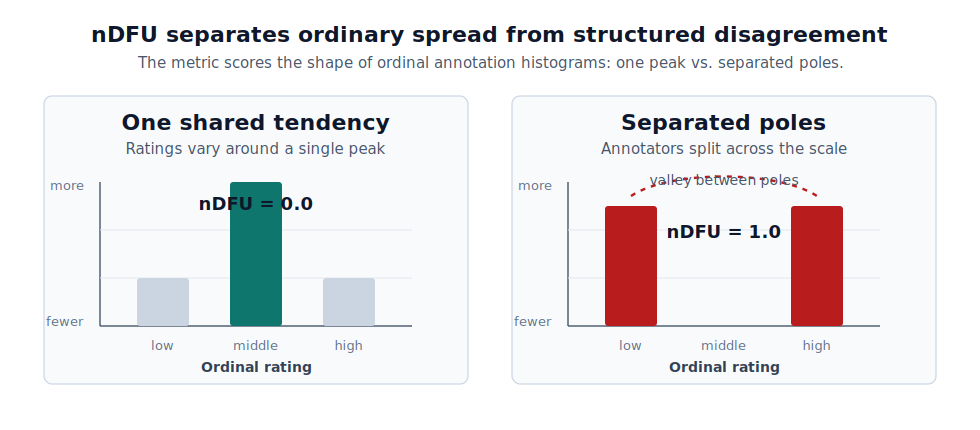
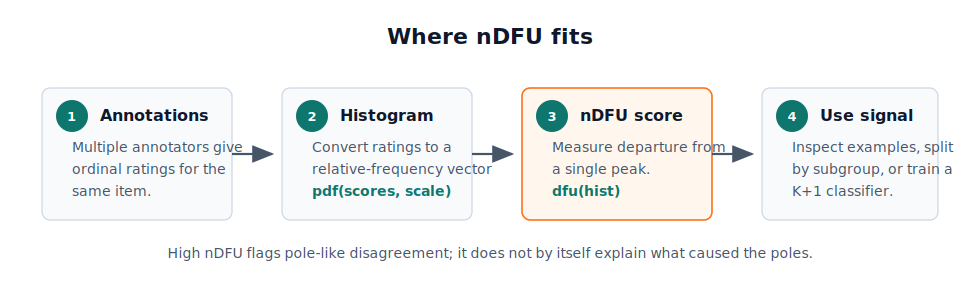

# The Normalized Distance from Unimodality (nDFU)

nDFU detects structured annotator disagreement in ordinal ratings. It is designed for cases where annotators do not merely vary around one shared judgment, but instead form separated poles in the rating distribution.

[Distance from unimodality (DFU)](https://github.com/ipavlopoulos/dfu/) measures how far a distribution is from unimodality, that is, from having a single peak. This repository provides a normalized version of that measure (nDFU), along with helper functions for turning ordinal annotations into relative-frequency vectors.

A low nDFU score means the annotations are compatible with one peak: consensus, near-consensus, or ordinary spread around a central tendency. A high nDFU score means the distribution departs from that single-peak shape, for example when many annotators choose low ratings and many others choose high ratings, with few annotations in between. In that sense, nDFU identifies disagreement that is structured as poles rather than unstructured noise.



nDFU is useful when annotation distributions should not be collapsed immediately into a single majority label. In the accompanying paper, nDFU is used as a signal for identifying pole-like, non-unimodal annotation patterns and for training a K+1-class classifier, where selected instances are assigned to an additional class instead of being forced into one of the original K classes.

An empirical analysis on three toxic-language datasets shows how this signal can be used to model polarized annotations and study conditions that may explain them, such as annotator gender or race.

nDFU does not by itself explain why the poles exist. It detects the shape of structured disagreement; subgroup analysis, qualitative inspection, or downstream modeling can then be used to study what the poles correspond to.



You may find the [article in the ACL proceedings](https://aclanthology.org/2024.eacl-long.117/), find an example [here](ndfu_example.ipynb), and reproduce the experiments [here](ndfu_application.ipynb). A separate notebook applies nDFU to the POPQUORN Potato-Prolific dataset [here](ndfu_popquorn_application.ipynb). Please note that datasets must be uploaded externally in the original application notebooks for licensing issues.

## Installation

```bash
pip install git+https://github.com/ipavlopoulos/ndfu.git
```

For local development:

```bash
git clone https://github.com/ipavlopoulos/ndfu.git
cd ndfu
pip install -e .
```

## Usage

Import the library and use the relative frequencies of ordinal ratings as input. Here, annotators are split between low and high ratings, so nDFU reports structured disagreement:

```python
>>> from ndfu import dfu, pdf
>>> rating = (1, 1, 2, 5, 5, 5)
>>> x = pdf(rating, range(1, 6))
>>> dfu(x)
0.3333333333333333
```

You can also pass a histogram directly:

```python
>>> dfu([0.2, 0.6, 0.2])
0.0
>>> dfu([0.5, 0.0, 0.5])
1.0
```

The first histogram has one central peak, so it is unimodal. The second has two separated peaks with a valley between them, so it represents pole-like disagreement.

Older examples that import `from ndfu.src import *` or `from src import *` are still supported for compatibility.

## Development

Run the test suite with:

```bash
pytest
```

## Contributing

Please cite this work as:

```
@inproceedings{pavlopoulos-likas-ndfu,
  title={Polarized Opinion Detection Improves the Detection of Toxic Language},
  author={Pavlopoulos, John and Likas, Aristidis},
  booktitle={Proceedings of the 18th Conference of the European Chapter of the Association for Computational Linguistics},
  year={2024}
}
```

Consider citing also the original [article](https://link.springer.com/article/10.1007/s12559-022-10088-2) as:
```
@article{pavlopoulos-likas-2022,
    title = "Distance from Unimodality for the Assessment of Opinion Polarization",
    author = "Pavlopoulos, John  and Likas, Aristidis",
    journal = "Cognitive Computation",
    doi = "10.1007/s12559-022-10088-2",
    year = "2022",
}
```
